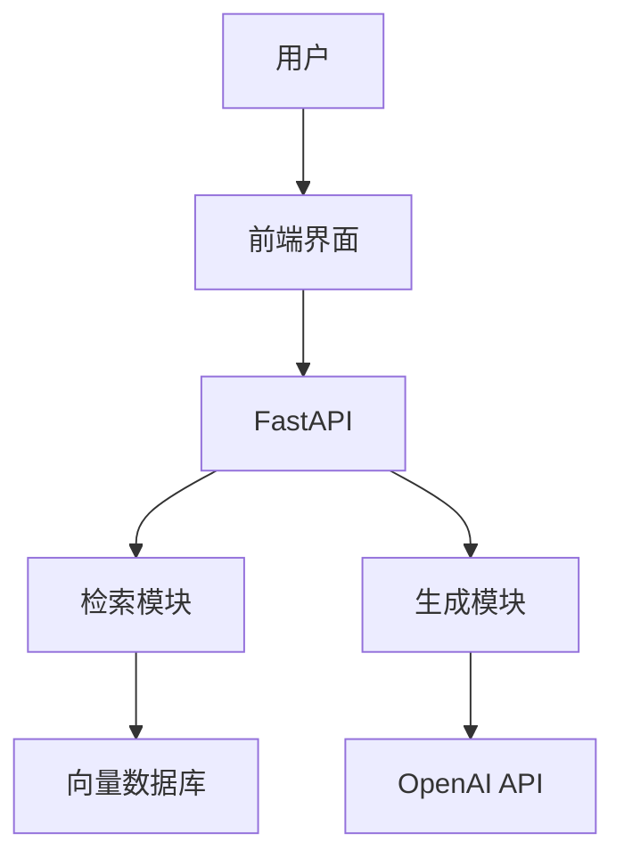

# 项目文档

## 一句话理解

项目文档就像"产品说明书"——没有它，用户不知道怎么用；有了它，用户能自己解决问题。好的文档能减少 80% 的沟通成本。

---

## 一、README 撰写技巧

### README 的标准结构

```markdown
# 项目名称

一句话描述项目是什么、做什么。

## 功能特性
- 功能一：简要说明
- 功能二：简要说明

## 快速开始

### 环境要求
- Python 3.9+
- ...

### 安装
```bash
git clone ...
cd ...
pip install -r requirements.txt
```

### 配置
```bash
cp .env.example .env
# 编辑 .env 填入 API Key
```

### 运行
```bash
python -m src.main
```

## 项目结构
```
project/
├── src/
├── tests/
└── ...
```

## API 文档
...

## 部署
...

## 常见问题
...

## 贡献指南
...

## 许可证
MIT
```

### 写好 README 的原则

1. **先写结论**：开头就说清楚项目是什么
2. **快速开始**：让新用户 5 分钟内能跑起来
3. **代码示例**：用代码展示用法，比文字更直观
4. **保持更新**：代码改了，文档也要跟着改

---

## 二、架构图绘制

### 文字架构图

```
┌──────────────┐
│   用户界面    │  Streamlit / Gradio
└──────┬───────┘
       │ HTTP
       ▼
┌──────────────┐
│   API 层     │  FastAPI
└──────┬───────┘
       │
       ▼
┌──────────────┐     ┌──────────────┐
│   检索模块    │────>│  向量数据库   │  Chroma
└──────┬───────┘     └──────────────┘
       │
       ▼
┌──────────────┐
│   生成模块    │  OpenAI API
└──────────────┘
```

### Mermaid 架构图



---

## 三、API 文档自动生成

### FastAPI 自动生成 API 文档

```python
from fastapi import FastAPI
from pydantic import BaseModel

app = FastAPI(
    title="RAG 知识库问答系统",
    description="基于检索增强生成的智能问答系统",
    version="1.0.0",
)

class QueryRequest(BaseModel):
    """查询请求"""
    question: str
    top_k: int = 3

class QueryResponse(BaseModel):
    """查询响应"""
    answer: str
    sources: list

@app.post("/query", response_model=QueryResponse)
async def query(request: QueryRequest):
    """
    用户提问接口

    - **question**: 用户问题
    - **top_k**: 检索数量
    """
    ...
```

FastAPI 会自动生成：
- Swagger UI：http://localhost:8000/docs
- ReDoc：http://localhost:8000/redoc

---

## 四、代码注释规范

### 文件头注释

```python
"""
文档加载模块

负责将各种格式的文件加载为统一的 Document 对象。
支持 TXT、PDF、Markdown 等格式。

用法：
    from src.document_processing.loader import DocumentLoader
    loader = DocumentLoader()
    docs = loader.load("data.txt")

作者：xxx
日期：2024-01-01
"""
```

### 函数注释

```python
def load_document(file_path: str, encoding: str = "utf-8") -> List[Document]:
    """
    加载单个文档文件。

    将指定路径的文件加载为 Document 对象列表。
    目前支持 TXT 和 Markdown 格式。

    Args:
        file_path: 文件的绝对或相对路径
        encoding: 文件编码，默认 utf-8

    Returns:
        Document 对象列表，每个 Document 包含：
        - page_content: 文档内容
        - metadata: 包含 source（来源路径）等信息

    Raises:
        FileNotFoundError: 文件不存在时抛出
        DocumentLoadError: 加载失败时抛出

    Examples:
        >>> loader = DocumentLoader()
        >>> docs = loader.load("data/test.txt")
        >>> print(docs[0].page_content[:50])
        '这是测试文档的内容...'
    """
```

---

## 五、变更日志（CHANGELOG）

```markdown
# Changelog

## [1.0.0] - 2024-06-01

### 新增
- 支持 TXT、PDF、Markdown 格式文档加载
- 完整的 RAG 管道（加载→切分→存储→检索→生成）
- Streamlit 聊天界面
- Docker Compose 部署支持

### 修改
- 优化文档切分策略，chunk_size 默认改为 500
- 改进 Prompt 模板，回答质量提升

### 修复
- 修复中文文件编码问题
- 修复 ChromaDB 连接超时问题

## [0.1.0] - 2024-05-01

### 新增
- 初始版本
- 基本的 RAG 功能
```

---

## 六、面试常问问题

### Q1: 一个好的 README 应该包含哪些内容？
**答**：至少包含：1）项目简介（一句话说明）；2）功能特性；3）快速开始（安装、配置、运行）；4）项目结构；5）API 文档（或链接）；6）部署说明；7）常见问题。

### Q2: 如何让文档保持更新？
**答**：1）把文档更新纳入开发流程（代码改了文档也要改）；2）用自动化工具（如 FastAPI 自动生成 API 文档）；3）定期审查文档（如每个版本发布前）；4）鼓励用户反馈文档问题。

### Q3: 什么是 API 文档自动生成？
**答**：通过代码中的类型注解和文档字符串，自动生成 API 文档。FastAPI 内置了这个功能，访问 /docs 就能看到 Swagger UI。好处是文档和代码同步，不会出现文档过期的问题。

### Q4: 代码注释应该写多少？
**答**：遵循"为什么"原则——不是解释代码做了什么（代码本身应该能看出来），而是解释为什么这样做。文件头注释说明模块用途，函数注释说明参数、返回值、异常，复杂的逻辑加行内注释。

### Q5: 如何绘制项目架构图？
**答**：三种方式：1）ASCII 字符画（简单，直接写在 README 里）；2）Mermaid 语法（Markdown 支持，可以渲染成图）；3）专业工具（draw.io、Excalidraw）。推荐 Mermaid，因为它和代码一起版本控制，且大多数平台都支持渲染。
